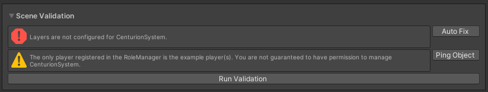
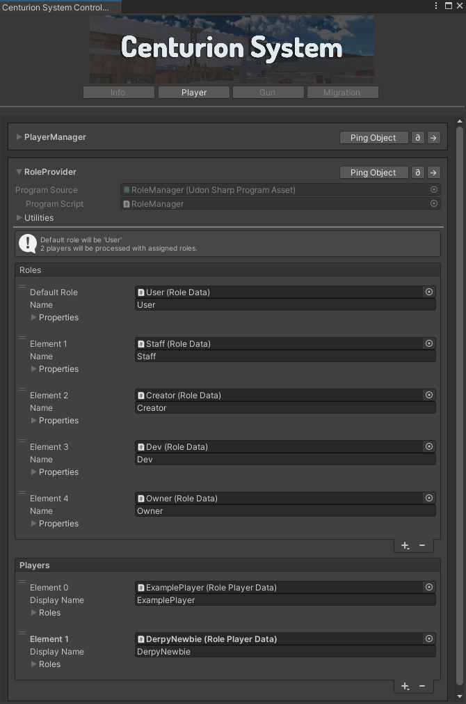
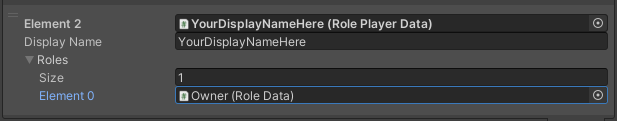

# サンプルシーンを見る

インポートしたサンプルシーンの内部を確認してみましょう。

`Assets/Samples/Centurion System/<version>/Sample Scene/` にある、`CenturionSystemSampleScene.unity` を開いてください。

:::tip

`TMP Importer` ウィンドウが表示された場合は、`Import TMP Essentials` をクリックで Text Mesh Pro をインポートし、
`TMP Importer` ウィンドウを閉じてください。

:::

## Centurion System Control Panel を確認する

シーンを開いたら、まずは Centurion System Control Panel を確認しましょう。

上部メニューバーから `Centurion System/Control Panel` をクリックし、Info パネルの `Run Validation` を実行してください。

### レイヤーをセットアップする

Centurion System は特定のレイヤー構成を前提に設定しているシステムであるため、初回のみレイヤーのセットアップが必要です。

`Scene Validation` に表示されている `Auto Fix` をクリックで、レイヤーをセットアップしましょう。

### RoleManager に自分のユーザー名を登録する

Centurion System は管理者権限の概念があり、サンプルシーンでは `ExamplePlayer` と `DerpyNewbie` に対してのみ権限を付与していますが、
これではあなたがシステムの全てに触れられません。

RoleManager で自分の名前をスタッフとして登録しましょう。

Centurion System Control Panel の Player タブを開くと、RoleProvider の情報を確認することができます。

Players の + ボタンから、`Add and assign generated RolePlayerData` を選択すると、新しい項目を追加できます。

- `Display Name` に "あなたの VRChat 内での表示名" を入れる
- `Roles` の `Size` を `1` にし、`Element 0` に `Owner` の `Role Data` を入れる

これであなたをこのワールドのオーナーとして登録できました。

:::info

このデータはシーンに保存されているため、シーン変えたり、上書きしてしまうと消えてしまいます。
Ping Object で表示された RoleManager を Prefab Variant の形などで保存しておき、使いまわせるようにしておくと良いでしょう。

:::

## サンプルシーンの動作を確認する

おめでとうございます! 前提となる設定をすべて完了したので、ついにサンプルシーンの挙動を確認することができます。

UnityEditor 上部の再生ボタンをクリックし、ClientSim で動作を確認したり、Build & Upload して実際の VRChat Client で試してみましょう。

:::info

ClientSim 上で権限がない場合は、上部メニューバー `VRChat SDK/ClientSim` から、`Player Settings` 下の `Local Player Name`
が正しいあなたの表示名になっているか確認してください。

:::

:::info

VRChat のクライアント上で権限がない場合は、Display Name が違う可能性があります。
VRChat Home (ウェブサイト) 等で表示名をコピーした後、[RoleManager に自分のユーザー名を登録](#rolemanager-に自分のユーザー名を登録する)しなおしてみてください。

:::