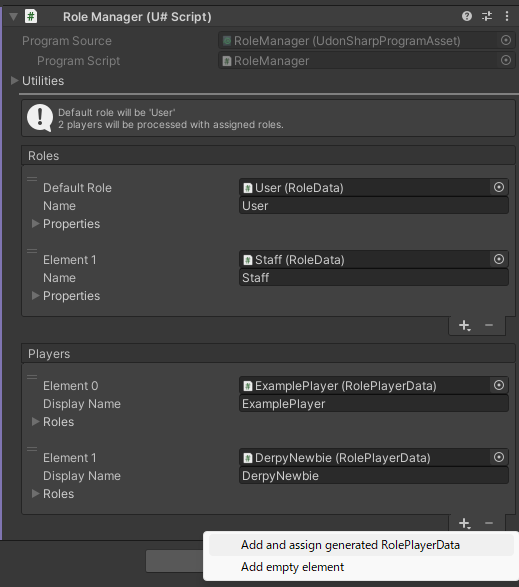
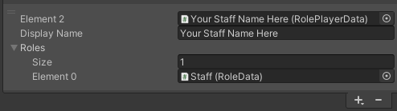

# スタッフメンバーを追加する

スタッフ･ﾒﾝﾊﾞｰを追加するには、[RoleManager](https://docs.derpynewbie.dev/newbie-commons/rolemanager) を編集する必要があります。

1. ヒエラルキー上で `Logics/System/RoleManager` を選択します
2.  `RoleManager` コンポーネントの `Players` リストにある `+` ボタンから `Add and assign generated RolePlayerData` を選択します

   

3. 追加された要素を以下に沿って変更します
   1. Staff のロールを `Roles` へ追加する
   2. `Display Name` をスタッフの VRChat 上での表示名に変更する
   
    

:::tip

`Display Name` は case-sensitive です。

上手くいかない場合は、表示名をウェブサイトの `https://vrchat.com/home/user/*` に表示されているカードから直接コピー&ペーストしてみてください。

:::

## ロール(RoleData) について

Centurion System では現在 3 つの Property を使用しています。

### moderator
- 管理者としてマークします
- NewbieConsole での管理者権限を付与します
  - 管理者のみに制限されている PlayerManager 周りの処理を実行できるようになります

### staff
- イベントスタッフとしてマークします
- [プレイヤータグ](/docs/player/external/playertag/externalplayertagmanager) として **Staff** の表示を追加します
  - このとき、ロール名によって表示するスタッフタグを変更します
    - `Owner`: **Owner** タグに変化します
    - `Developer`: **Dev** タグに変化します

### creator
- スタッフではないが、制作に関わっている人としてマークします
- [プレイヤータグ](/docs/player/external/playertag/externalplayertagmanager) として **Creator** の表示を追加します
  - デフォルトでは非表示なので、NewbieConsole 等にて Creator Tag の有効化をする必要があります
    - e.x: `PlayerManager ShowCreatorTag true`
