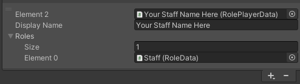

# Add Staff Member

To Add Staff Member, You will need to configure [RoleManager](https://docs.derpynewbie.dev/newbie-commons/rolemanager).

1. Select `Logics/System/RoleManager` GameObject in the hierarchy.
2. Click `+` button under `RoleManager` component's `Players` list

   

3. Modify added element as follows
   1. Add Staff role to `Roles`
   2. Change `Display Name` to your staff's VRChat account display name.
   
    

:::tip

`Display Name` is case-sensitive.

If you really want to make sure, Take display names directly from `https://VRChat.com/home/user/*`, Copy names from the card.

:::